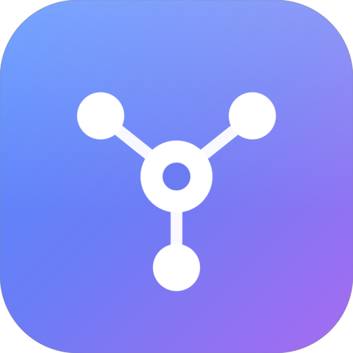

# AI Hub Desktop

<p align="center">
  
</p>

<p align="center">
  <strong>One window for every AI assistant.</strong><br>
  ChatGPT, Claude, Gemini and friends live side by side in sandboxed tabs,
  each behind its own domain allow-list, with automatic memory management.
</p>

<p align="center">
  <a href="https://github.com/SilentCoderHere/aihub-desktop/actions/workflows/ci.yml"></a>
  <a href="LICENSE"></a>
  <a href="https://www.electronjs.org"></a>
</p>

---

## Why?

Juggling a dozen browser profiles for your AI tools is noisy and leaky. AI Hub
Desktop gives every service its own **sandboxed `WebContentsView` tab** and a
**per-service network allow-list**, so each assistant only talks to the domains
it actually needs - stray trackers and pixels are dropped before they leave
your machine.

## Features

- **Multi-tab, multi-service** - open ChatGPT, Claude, Gemini, Copilot,
  Perplexity and more at once; drag to reorder, middle-click to close.
- **Domain filtering** - suffix-aware allow-lists per service, shared auth
  domains, an optional *Strict mode*, live blocked-request counters.
- **Memory aware** - a concurrent-tab limit plus **automatic hibernation** of
  idle tabs tears down background renderers and rebuilds them on demand.
- **Offline-first** - a validated catalogue + rule set ships with the app; the
  remote list refreshes in the background and can never corrupt the cache.
- **Privacy controls** - deny-by-default permissions with prompts, session
  wipe, proxy support, "open in browser" instead of pop-up windows.
- **Session restore** - tabs and the active tab survive restarts.
- **System integration** - tray with open-tab menu, global show/hide shortcut,
  launch-at-login, `aihub://` deep links, auto-update.
- **Polished shell** - dark/light themes, sidebar search, toasts, context
  menus, keyboard shortcuts and a shortcut reference (`?`).

## Quick start

```bash
npm install
npm start
```

### Windows (no terminal required)

Double-click in `scripts/windows/`:

| Script | Action |
|--------|--------|
| `Setup.bat` | Install Node.js + dependencies, run the doctor |
| `Run.bat` | Launch the app |
| `Build.bat` | Lint, test and build the installer into `dist\` |
| `Test.bat` | Run lint + tests |

See [scripts/windows/README.md](scripts/windows/README.md).

### Everything else

```bash
npm run doctor        # diagnose this environment
npm run dev           # auto-restart on changes
npm test              # unit + smoke tests
npm run check         # lint + tests (CI)
npm run benchmark     # performance micro-benchmarks
npm run build:win     # package (also :mac / :linux)
```

## Keyboard shortcuts

Press `?` in the app for the full list. Highlights: `Ctrl+T` picker,
`Ctrl+Tab` next tab, `Ctrl+W` close tab, `Ctrl+,` settings,
`Ctrl+Shift+A` (global) show/hide. On macOS use `⌘`.

## Documentation

| | |
|---|---|
| [Architecture](docs/architecture.md) | process model, IPC, tab lifecycle, hibernation |
| [Configuration](docs/configuration.md) | every setting and its effect |
| [Security model](docs/security.md) | what the filter does and does not do |
| [Development](docs/development.md) | setup, scripts, tests, conventions |
| [Packaging](docs/packaging.md) | electron-builder, auto-update, one-click scripts |
| [Troubleshooting](docs/troubleshooting.md) | reading the log, common problems |
| [Roadmap](docs/roadmap.md) | suggested next improvements |

## Contributing

Read [CONTRIBUTING.md](CONTRIBUTING.md). Please report vulnerabilities per
[SECURITY.md](SECURITY.md), not as public issues.

## License

[MIT](LICENSE)
